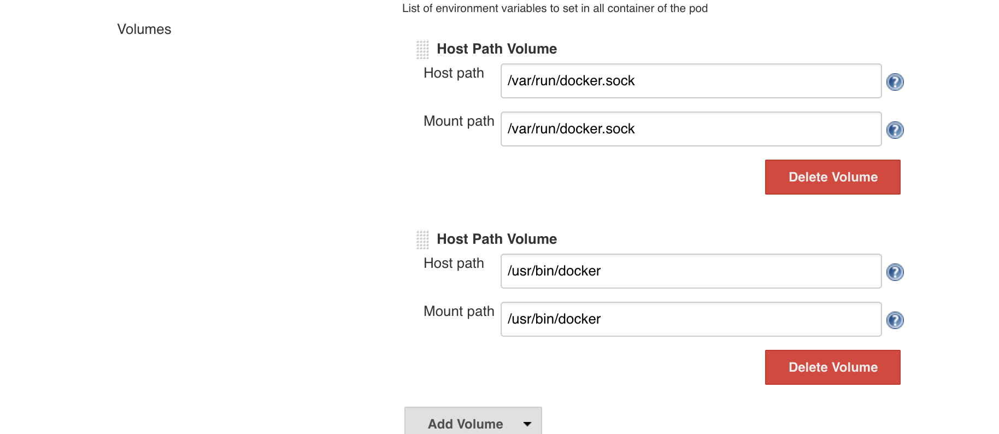

# 5 Step CI/CD In Kubernetes using Artifactory, Jenkins & Helm

# Contents

- [Setup Kubernetes Cluster on GKE](#setup-kubernetes-cluster-on-gke)
- [Setup Kubernetes Cluster on AKS](#setup-kubernetes-cluster-on-aks)
- [Install Artifactory on kubernetes](#install-artifactory-on-kubernetes)
- [Install Jenkins on kubernetes](#install-jenkins-on-kubernetes)
- [Configure Continuous Integration/Continuous Deployment](#5-step-cicd)


### Prerequisites
* Basic knowledge of [Docker](https://www.docker.com/), [Jenkins](https://jenkins.io/), [Kubernetes](https://kubernetes.io/) and [Artifactory](https://www.jfrog.com/artifactory/)

## Setup Kubernetes Cluster on GKE
Follow this to setup kubernetes cluster on GKE. [https://cloud.google.com/container-engine/docs/quickstart](https://cloud.google.com/container-engine/docs/quickstart)

## Setup Kubernetes Cluster on AKS
Follow this to setup kubernetes cluster on AKS. [https://docs.microsoft.com/en-us/azure/aks/tutorial-kubernetes-deploy-cluster](https://docs.microsoft.com/en-us/azure/aks/tutorial-kubernetes-deploy-cluster)

## Install Artifactory on kubernetes
Here is documentation to install JFrog Artifactory on kubernetes [artifactory-docker-examples](https://github.com/JFrogDev/artifactory-docker-examples/tree/master/kubernetes)<br>

<b>Note</b> If you are using [Artifactory SaaS](https://www.jfrog.com/artifactory/free-trial/#Cloud) you can skip this step. 

### Configure docker insecure registry in each node of kubernetes cluster if you are using self-signed certificate.

*   Get cluster ip  of nginx services by running following command:
    ```
    kubectl get services nginx-kubernetes-service
    ```
*   Ssh into each node of cluster and configure insecure registry using steps provided [here](https://docs.docker.com/registry/insecure/)

    <b>Note</b>: configure range which include `$CLUSTER_IP` as insecure registry.
    
*   Add following entry in `/etc/hosts` file:
    ```
    $CLUSTER_IP     docker.artifactory docker-remote.artifactory docker-local.artifactory
    ```
*   Pull `node` docker image from artifactory by running following command:
    ``` 
    docker pull docker.artifactory/node
    ```

## Install Jenkins on kubernetes

Use [Helm](https://github.com/kubernetes/helm) [Chart](https://github.com/kubernetes/charts) to install [jenkins](https://github.com/kubernetes/charts/tree/master/stable/jenkins) in kubernetes. <br>
<b>Note</b>: Make sure to increase resources for Jenkins deployment in [values.yaml](https://github.com/kubernetes/charts/blob/master/stable/jenkins/values.yaml) file. Jenkins comes with the Kubernetes plugin..<br>
Cache docker images of jenkins master and agent in Artifactory by changing value of `Master.Image` to `docker.artifactory/jenkinsci/jenkins` and `Agent.Image` to `docker.artifactory/jenkinsci/jnlp-slave` in [values.yaml](https://github.com/kubernetes/charts/blob/master/stable/jenkins/values.yaml) file.


### Configuring Jenkins to build docker images:

* From Jenkins home click on Manage Jenkins -> 	Configure System.
* You will see section Cloud -> Kubernetes -> Images -> Volumes.
* Click on Add Volume and add Host Path Volume with following mount path:
  
* ssh into each kubernetes node of your cluster and perform following:
  1. Create `jenkins` user.
  2. Add `jenkins` user to docker group.
  3. Make sure `jenkins` user can access `/var/run/docker.sock` and  `/usr/bin/docker` in each kubernetes node.
  4. Create `test` job in Jenkins and run `docker version` command from `test` job. 

# 5 Step CI/CD
  
## Step 1. Create an application war file
* Creates a sample application called ‘webservice-1.1.2.war’
* Pushes it to a local repository in Artifactory
* [gradle-example](/gradle-example)

## Step 2. Create a template Docker image
* Creates a base Docker image called ‘docker-framework’ using Ubuntu + Java + Tomcat
* Pushes it to a local repository in Artifactory
* [docker-framework](/docker-framework)

## Step 3. Create a product Docker image
* Downloads, from Artifactory, the ‘webservice-1.1.2.war’ file and the ‘docker-framework’ Docker image, that were created in the previous two pipelines
* Creates a ‘docker-app’ production Docker image
* Pushes it to Artifactory
* Promotes it to a production repository in Artifactory
* [docker-app](/docker-app)

## Step 4. Create Helm chart of product Docker image
* Create helm chart of `docker-app`
* Push helm chart in local helm repository in Artifactory
* [chart](/docker-app-chart)

## Step 5. Deploy `docker-app` in Kubernetes cluster using helm chart
* Pull helm chart from Virtual helm repository of Artifactory
* Deploy `docker-app` in Kubernetes using downloaded helm chart
* [deploy](/deploy)